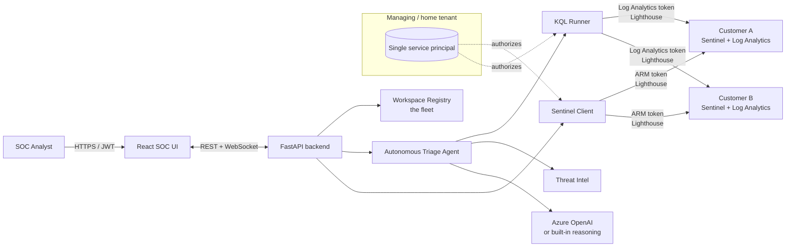

# 🛡️ Microsoft Sentinel AI SOC Agent — Local Analyst MCP Server

> **You are on `analyst-local`, the default branch.** It holds the version each
> analyst runs **on their own machine**: an MCP server that plugs Microsoft Sentinel
> — across every customer workspace delegated to you via Azure Lighthouse — into
> Claude Desktop, Claude Code or VS Code. It authenticates as the signed-in analyst
> (`az login`), so there are no secrets on laptops and every action in Sentinel is
> attributed to the person who took it.
>
> **Analyst quick start** (full runbook: [`backend/docs/ANALYST_LOCAL_SETUP.md`](backend/docs/ANALYST_LOCAL_SETUP.md)):
>
> ```bash
> az login --tenant <managing-tenant-id>
> git clone https://github.com/riparino/ai-soc-agent-for-microsoft-sentinel.git
> cd ai-soc-agent-for-microsoft-sentinel/backend
> python3 -m venv venv && source venv/bin/activate && pip install -r requirements.txt   # Windows: .\venv\Scripts\Activate.ps1
> cp .env.example .env    # set DEMO_MODE=False, AZURE_AUTH_MODE=user, AZURE_TENANT_ID, WORKSPACES_CONFIG_PATH
> ./run-mcp.sh --check                          # Windows: .\run-mcp.ps1 --check
> ./run-mcp.sh --print-config claude-desktop    # paste into your MCP client (or: vscode, claude-code)
> ```
>
> **Branch map**
>
> | Branch | Purpose |
> |--------|---------|
> | `analyst-local` (default) | Per-analyst local MCP server — this branch. Also contains the shared backend (fleet registry, Sentinel/KQL clients) and the Copilot Studio-ready MCP server. |
> | `web-console` (formerly `main`) | The hosted web SOC console (FastAPI + React) for a shared deployment; the multi-tenant re-architecture PR lands here. |
> | `claude/*` | Working branches behind the pull requests; not for direct use. |

---

## The platform underneath


An autonomous AI SOC analyst for **Microsoft Sentinel**, built for **MSSPs and
multi-tenant enterprises**. A single deployment manages a **fleet of Sentinel
workspaces across delegated customer tenants** (an **Azure Lighthouse** estate) and
gives analysts one web workbench to triage incidents, run Log Analytics (KQL)
hunts, correlate threat intelligence, and take SOAR remediation actions — across
every tenant, from your managing tenant.

> **Already have Azure Lighthouse onboarded?** Jump to
> [Set it up for your Lighthouse fleet](#-set-it-up-for-your-lighthouse-fleet).

---

## Table of contents

- [What it is](#-what-it-is)
- [How it works](#-how-it-works)
- [The multi-tenant model (Azure Lighthouse)](#-the-multi-tenant-model-azure-lighthouse)
- [Set it up for your Lighthouse fleet](#-set-it-up-for-your-lighthouse-fleet)
- [Configuration reference](#-configuration-reference)
- [Deployment](#-deployment)
- [Using the workbench](#-using-the-workbench)
- [MCP server (Claude, GitHub Copilot, Copilot Studio)](#-mcp-server-claude-github-copilot-copilot-studio)
- [Testing](#-testing)
- [Repository layout](#-repository-layout)

---

## 🧭 What it is

A web app (FastAPI backend + React SOC UI) that acts as a Tier‑1/Tier‑2 analyst:

- **Autonomous incident triage** — extracts entities (users, IPs, hosts, hashes,
  processes), runs contextual KQL hunts, correlates threat intel (AbuseIPDB,
  VirusTotal, Microsoft Defender TI), reaches a **True/False Positive** verdict with
  a confidence score, maps to **MITRE ATT&CK**, and writes the report back to the
  incident as a comment.
- **Fleet-wide** — lists and triages incidents from **many Sentinel workspaces in
  different tenants** at once, from one running instance, using Azure Lighthouse
  delegation. Pick a single customer, several, or aggregate the whole estate.
- **Interactive workbench** — live agent execution trace, a KQL generator with
  one-click execution, incident assignment, and a mandatory close‑and‑classify flow.
- **One‑click SOAR** — endpoint isolation, IP blocking, session revoke, account
  disable, playbook trigger, and auto‑close false positives (with the Graph‑scope
  guardrails described below).

It runs out of the box in **demo mode** (no Azure needed) with seeded mock data, and
flips to live by supplying credentials.

---

## ⚙️ How it works

### Request flow



### The key idea: one credential, many workspaces

Under **Azure Lighthouse**, a single service principal in your **managing (home)
tenant** can reach **Azure Resource Manager** (`management.azure.com`) and **Log
Analytics** (`api.loganalytics.io`) across **every delegated customer
subscription**. Azure Resource Manager consumes the delegation and authorizes the
managing‑tenant token against the customer's resources — so the SP's ARM and Log
Analytics tokens are **shared by the whole fleet**. The only per‑workspace data the
app needs is each customer's **subscription / resource group / workspace** name.

### Incident routing via namespaced IDs

Incidents are returned with a **namespaced ID** — `‹workspace_id›::‹incident_guid›`
— plus `workspaceId`, `workspaceName`, and `workspaceTenantId`. Every follow‑up
call (open, triage, chat, comment, status change, assign, remediate, the triage
WebSocket) carries that ref, and the backend resolves the owning workspace from it.
No global "current workspace" state; the workspace travels with the request.

### Workspace selection & aggregation

`GET /api/incidents` and `/api/incidents/stats/summary` take a `workspace` selector:
omit it (or `all`) to aggregate the whole fleet, pass one id for a single customer,
or a comma‑separated list for a subset. The UI exposes this as a workspace/tenant
dropdown; stats include a per‑workspace breakdown. Fleet‑wide listing fans out to
workspaces **concurrently** (bounded) and skips per‑incident enrichment (the detail
view fetches that on demand), so it scales to large estates.

### Verdict engine

Triage uses **Azure OpenAI** (or standard OpenAI) when configured; otherwise it
falls back to a **deterministic SOC reasoning engine** so the product is fully
functional without an LLM key.

---

## 🛰️ The multi-tenant model (Azure Lighthouse)

### What Lighthouse covers — and what it doesn't

| Plane | Endpoint | Delegated by Lighthouse? | Used for |
|-------|----------|--------------------------|----------|
| Azure Resource Manager | `management.azure.com` | ✅ Yes | Sentinel incidents: list, read, comment, status, assign, labels |
| Log Analytics query | `api.loganalytics.io` | ✅ Yes | KQL hunts, SigninLogs/telemetry, workspace‑GUID resolution |
| **Microsoft Graph** | `graph.microsoft.com` | ❌ **No** | Entra ID directory reads, session revoke, account disable |

Azure Lighthouse is **Azure delegated resource management** — it delegates Azure
RBAC on subscriptions/resource groups. **Microsoft Graph / Entra ID is tenant‑bound
and is _not_ delegated by Lighthouse.** A Graph token minted with your home SP only
ever sees your **home** tenant's directory. The app handles this explicitly (below).

### Microsoft Graph handling (`graph_mode`)

Each workspace gets a `graph_mode` that decides how identity features behave:

| `graph_mode` | When | List users | Revoke session / disable account |
|--------------|------|-----------|----------------------------------|
| `managing-tenant` | workspace is in your home tenant | Microsoft Graph (home SP) | ✅ allowed |
| `delegated-app` | per‑customer Graph app configured on the entry | Microsoft Graph (customer app) | ✅ allowed |
| `log-analytics-only` | delegated tenant, no per‑customer Graph app | **SigninLogs telemetry** (via Lighthouse) | ❌ refused with `BLOCKED_GRAPH_SCOPE` |

So for a delegated customer with no extra setup: ARM/Defender actions (isolate
endpoint, block IP, trigger playbook, close FP) **work across Lighthouse**, user
lists are derived from the customer workspace's own `SigninLogs`, and identity
**write** actions are **clearly refused** instead of silently failing. To enable
full identity actions for a customer, register a Graph app **in that customer
tenant** and add its credentials to the workspace entry (see below).

Full details: **[`backend/docs/MULTI_TENANT.md`](backend/docs/MULTI_TENANT.md)**.

---

## 🚀 Set it up for your Lighthouse fleet

This assumes **Azure Lighthouse is already onboarded** for your customers (each
customer subscription delegated to your managing tenant).

### 1. Prerequisites in the managing tenant

1. **A service principal** (app registration) in your managing tenant. Create a
   client secret; note the **tenant ID**, **client ID**, **client secret**.
2. **Delegate the right Sentinel role** to that SP (or a group it belongs to) in
   your Lighthouse authorizations:
   - **Microsoft Sentinel Responder** — read **and write** incidents (required to
     comment, reclassify, assign, close).
   - **Log Analytics Reader** — run KQL hunts.
   (Read‑only `Microsoft Sentinel Reader` works for a view‑only deployment, but the
   agent won't be able to update incidents.)
3. **Register resource providers** `Microsoft.OperationalInsights` and
   `Microsoft.SecurityInsights` on a subscription in your **managing** tenant (they
   must also be registered in each customer tenant — normally already true if they
   run Sentinel).

### 2. Describe your fleet

Create `backend/workspaces.json` listing your delegated workspaces (copy
[`backend/workspaces.example.json`](backend/workspaces.example.json)):

```json
{
  "workspaces": [
    {
      "id": "contoso",
      "display_name": "Contoso Ltd",
      "tenant_id": "<contoso-tenant-guid>",
      "subscription_id": "<contoso-subscription-guid>",
      "resource_group": "rg-sentinel-contoso",
      "workspace_name": "contoso-sentinel"
    },
    {
      "id": "fabrikam",
      "display_name": "Fabrikam Inc",
      "tenant_id": "<fabrikam-tenant-guid>",
      "subscription_id": "<fabrikam-subscription-guid>",
      "resource_group": "rg-sentinel-fabrikam",
      "workspace_name": "fabrikam-sentinel",

      "graph_tenant_id": "<fabrikam-tenant-guid>",
      "graph_client_id": "<app-id-registered-in-fabrikam>",
      "graph_client_secret": "<secret>"
    }
  ]
}
```

- `workspace_guid` (the Log Analytics `customerId`) is **optional** — it's
  auto‑resolved from ARM on first use.
- Add `graph_tenant_id` / `graph_client_id` / `graph_client_secret` only for
  customers where you've registered a Graph app and want full identity actions.
  Omit them to run that customer in `log-analytics-only` mode.
- Set `"is_managing_tenant": true` on the workspace (if any) that lives in your home
  tenant. (A tenant matching `AZURE_TENANT_ID` is auto‑flagged.)
- Scales to hundreds of entries.

### 3. Point the app at it

In `backend/.env` (managing‑tenant SP + the fleet file):

```env
DEMO_MODE=False

# Managing (home) tenant service principal — shared across the whole fleet
AZURE_TENANT_ID="<managing-tenant-guid>"
AZURE_CLIENT_ID="<sp-client-id>"
AZURE_CLIENT_SECRET="<sp-client-secret>"

# The delegated workspace fleet
WORKSPACES_CONFIG_PATH="./workspaces.json"

# AI verdict engine (optional — falls back to the built-in engine if omitted)
LLM_PROVIDER="azure_openai"
AZURE_OPENAI_ENDPOINT="https://YOUR_AOAI.openai.azure.com/"
AZURE_OPENAI_API_KEY="YOUR_AZURE_OPENAI_KEY"
AZURE_OPENAI_DEPLOYMENT_NAME="gpt-5.2"
AZURE_OPENAI_API_VERSION="2024-05-01-preview"
```

> Prefer an **inline** definition? Set `WORKSPACES_JSON=[ ... ]` instead of the
> file path. Prefer **Managed Identity** (e.g. on AKS with a federated credential
> that holds the Lighthouse delegation)? Set `USE_MANAGED_IDENTITY=True` and omit
> the SP secret.

### 4. Run it

See [Deployment](#-deployment). On start you'll see the fleet load in the logs
(`Workspace registry loaded N workspace(s) ...`) and the workspace dropdown in the
UI will list every customer.

### 5. Verify

```bash
# the fleet the app sees
curl -H "Authorization: Bearer <jwt>" http://localhost:8000/api/incidents/workspaces

# incidents for one customer / the whole estate
curl -H "Authorization: Bearer <jwt>" "http://localhost:8000/api/incidents?workspace=contoso"
curl -H "Authorization: Bearer <jwt>" "http://localhost:8000/api/incidents?workspace=all"
```

---

## 🔧 Configuration reference

| Variable | Purpose |
|----------|---------|
| `AZURE_TENANT_ID` / `AZURE_CLIENT_ID` / `AZURE_CLIENT_SECRET` | Managing‑tenant SP, shared across the fleet (ARM + Log Analytics via Lighthouse). |
| `USE_MANAGED_IDENTITY` | Use a managed identity instead of an SP secret. |
| `WORKSPACES_CONFIG_PATH` | Path to the fleet JSON file (array or `{ "workspaces": [...] }`). |
| `WORKSPACES_JSON` | Inline JSON array of workspace entries (alternative to the file). |
| `AZURE_SUBSCRIPTION_ID` / `AZURE_RESOURCE_GROUP_NAME` / `AZURE_WORKSPACE_NAME` / `AZURE_WORKSPACE_ID` | Single/default workspace — used only when no fleet is configured (backward compatible). |
| `DEMO_MODE` | `True` runs on seeded mock data (two demo workspaces); `False` goes live. |
| `LLM_PROVIDER`, `AZURE_OPENAI_*`, `OPENAI_API_KEY` | AI verdict engine (optional). |
| `ABUSEIPDB_API_KEY`, `VIRUSTOTAL_API_KEY`, `ENABLE_MICROSOFT_THREAT_INTEL`, `MDTI_API_KEY` | Threat‑intel providers (optional). |
| `AUTO_POST_COMMENTS_TO_SENTINEL`, `AUTO_CLOSE_FALSE_POSITIVES` | Automation toggles. |

**Workspace entry fields:** `id`, `display_name`, `tenant_id`, `subscription_id`,
`resource_group`, `workspace_name`, `workspace_guid` (optional), `is_managing_tenant`
(optional), and optionally `graph_tenant_id` / `graph_client_id` /
`graph_client_secret`. See [`backend/.env.example`](backend/.env.example) for the
full template.

### Resolution order for the fleet

1. `WORKSPACES_JSON` (inline) → 2. `WORKSPACES_CONFIG_PATH` (file) → 3. the single
`AZURE_*` workspace → 4. a two‑workspace demo seed (when nothing is configured).

---

## 📦 Deployment

### First-run authentication

Initial passwords for the built‑in accounts (`soc_admin`, `analyst`,
`tier1_analyst`) are generated randomly on first startup and printed **once** in the
backend logs. Each account must set a new password on first login; plaintext is
never persisted.

```text
================================================================================
🔒 FIRST-RUN INITIALIZATION: Generated Initial Account Credentials
  Username: soc_admin     | Role: admin   | Temporary Password: <generated>
  Username: analyst       | Role: analyst | Temporary Password: <generated>
  Username: tier1_analyst | Role: analyst | Temporary Password: <generated>
================================================================================
```

### Local (development)

**macOS**
```bash
brew install python@3.11 node
git clone https://github.com/riparino/ai-soc-agent-for-microsoft-sentinel.git
cd ai-soc-agent-for-microsoft-sentinel

# Backend (Terminal 1)
cd backend
python3.11 -m venv venv && source venv/bin/activate
pip install --upgrade pip && pip install -r requirements.txt
cp .env.example .env            # add managing-tenant creds + WORKSPACES_CONFIG_PATH
uvicorn app.main:app --host 127.0.0.1 --port 8000 --reload
```
```bash
# Frontend (Terminal 2)
cd ai-soc-agent-for-microsoft-sentinel/frontend
npm install && npm run dev      # dev UI on http://localhost:3000 (proxies /api → :8000)
```

**Windows (PowerShell)**
```powershell
git clone https://github.com/riparino/ai-soc-agent-for-microsoft-sentinel.git
cd ai-soc-agent-for-microsoft-sentinel\backend
python -m venv venv; .\venv\Scripts\activate
pip install --upgrade pip; pip install -r requirements.txt
Copy-Item .env.example .env     # add managing-tenant creds + WORKSPACES_CONFIG_PATH
uvicorn app.main:app --host 127.0.0.1 --port 8000 --reload
# in a second window:
cd ..\frontend; npm install; npm run dev
```

### Docker (single container, built UI + API)

```bash
docker-compose up --build
# dashboard on http://localhost:8000
```

To run the fleet in Docker, mount your fleet file and point the app at it:

```yaml
# docker-compose.yml (service: sentinel-soc-agent)
environment:
  - DEMO_MODE=false
  - AZURE_TENANT_ID=<managing-tenant-guid>
  - AZURE_CLIENT_ID=<sp-client-id>
  - AZURE_CLIENT_SECRET=<sp-client-secret>
  - WORKSPACES_CONFIG_PATH=/etc/sentinel/workspaces.json
volumes:
  - ./backend/workspaces.json:/etc/sentinel/workspaces.json:ro
```

### Azure Kubernetes Service (AKS)

Manifests are in [`aks/`](aks/) (namespace, ConfigMap, Secret, Deployment with a
non‑root security context, Service, Ingress). The automated script:

```bash
# Bash
cd aks && chmod +x deploy-to-aks.sh
./deploy-to-aks.sh "<SUB_ID>" "<RG>" "<AKS_NAME>" "<ACR_NAME>"
```
```powershell
# PowerShell
cd aks
.\deploy-to-aks.ps1 -SubscriptionId "<SUB_ID>" -ResourceGroup "<RG>" -AksClusterName "<AKS_NAME>" -AcrName "<ACR_NAME>"
```

**Managing‑tenant creds** go in `aks/secret.yaml` (`AZURE_CLIENT_SECRET`,
`AZURE_OPENAI_API_KEY`, `SECRET_KEY`). **Non‑secret coordinates** and
`WORKSPACES_CONFIG_PATH=/etc/sentinel/workspaces.json` are in `aks/configmap.yaml`.

**Load the fleet** as a Secret the Deployment mounts at `/etc/sentinel` (the mount
is `optional: true`, so without it the app runs single‑workspace):

```bash
kubectl create secret generic sentinel-soc-fleet \
  --namespace sentinel-soc \
  --from-file=workspaces.json=./backend/workspaces.json
# rollout to pick it up:
kubectl rollout restart deployment/sentinel-soc-agent -n sentinel-soc
```

> On AKS you can instead give the pod a **workload identity** that holds the
> Lighthouse delegation and set `USE_MANAGED_IDENTITY=true` (drop the SP secret).

---

## 🖥️ Using the workbench

- **Workspace / tenant selector** (incident queue) — one customer, several, or
  *All Workspaces* to aggregate the estate. Each row shows its origin workspace when
  aggregating; stats show a per‑workspace breakdown.
- **Run AI triage** — streams the agent's live execution trace, then produces a
  report (verdict, confidence, MITRE mapping, evidence, recommended actions, RCA),
  posted back to the incident in its own tenant.
- **KQL generator** — one‑click hunts that run against the selected incident's own
  workspace.
- **Assign / close & classify** — assignment lists the incident tenant's users
  (Graph or SigninLogs telemetry depending on `graph_mode`); closing requires a
  classification + reason.
- **Remediation** — isolate endpoint, block IP, trigger playbook, close FP work
  fleet‑wide; **revoke session / disable account** are allowed only where
  `graph_mode` permits and otherwise return a clear scope message (not a fake
  success).

---

## 🔌 MCP server (Claude, GitHub Copilot, Copilot Studio)

The agent's capabilities are also exposed as **Model Context Protocol** tools
(`backend/app/mcp_server.py`) so analysts can run fleet‑wide triage from the
assistants they already use — Claude (Enterprise connectors, Desktop, Claude Code),
GitHub Copilot (VS Code agent mode / coding agent), and Microsoft Copilot Studio
(and from there, Teams).

```bash
cd backend
./run-mcp.sh                                 # stdio — local clients, zero network, great for testing
./run-mcp.sh --transport streamable-http     # http://127.0.0.1:8800/mcp (no auth; loopback only)
MCP_AUTH_MODE=entra ./run-mcp.sh --transport streamable-http --host 0.0.0.0   # shared / remote
```

- **13 tools**: list workspaces/incidents, get incident, run AI triage, fetch report,
  KQL, threat intel, comment, status/classification, assign, remediate. Namespaced
  incident refs route every call to the right delegated tenant; destructive tools
  are annotated so clients confirm first, and the Graph/Lighthouse guardrail applies.
- **Local**: add `backend/run-mcp.sh` as a stdio server in Claude Code
  (`claude mcp add sentinel-soc -- /path/backend/run-mcp.sh`), Claude Desktop, or
  VS Code `.vscode/mcp.json`. Works fully in `DEMO_MODE` with no Azure.
- **Per-analyst local mode**: `AZURE_AUTH_MODE=user` makes the server authenticate as
  the signed-in analyst (`az login`) — no secrets on laptops, every Sentinel action
  attributed to them; `--check` self-diagnoses the install and `--print-config`
  emits the client snippet. Runbook: [`backend/docs/ANALYST_LOCAL_SETUP.md`](backend/docs/ANALYST_LOCAL_SETUP.md).
- **Remote**: Streamable HTTP with **Microsoft Entra ID** bearer auth
  (`MCP_AUTH_MODE=entra`, `MCP_ENTRA_AUDIENCE=<app id>`): tokens are validated
  against your tenant's JWKS and the server publishes RFC 9728 protected‑resource
  metadata for client OAuth discovery.

- **Plays well with other servers**: `sentinel_extract_indicators` hands an incident's
  IPs/hosts/accounts/hashes to your threat‑intel and cloud‑inventory tools, and
  `MCP_DISABLED_TOOLS` trims overlapping tools (schemas are kept flat so nothing is
  dropped on import into Copilot Studio).

👉 Setup for each client, Entra app registration, and deployment:
[`backend/docs/MCP_SERVER.md`](backend/docs/MCP_SERVER.md) · adding it to an existing
Copilot Studio agent next to intel/cloud MCP servers:
[`backend/docs/COPILOT_STUDIO.md`](backend/docs/COPILOT_STUDIO.md).

---

## 🧪 Testing

```bash
cd backend
pytest -v
```

Includes `tests/test_workspace_routing.py`, which exercises the registry, incident
namespacing, per‑workspace selection and aggregation, ref‑based routing, and the
Microsoft Graph scope limitation — all over the in‑memory mock path (no live Azure
required).

---

## 🗂️ Repository layout

```
backend/
  app/
    services/workspace_registry.py   # the fleet: load, namespace, route, graph_mode
    services/sentinel_client.py      # fleet-aware ARM client (shared home-tenant token)
    services/kql_runner.py           # fleet-aware Log Analytics (per-workspace GUID)
    services/remediation_service.py  # SOAR + Graph-scope guardrails
    agent/                           # autonomous triage agent + tools
    api/                             # incidents / triage / settings routes
    mcp_server.py                    # MCP server (stdio + Streamable HTTP, Entra auth)
  docs/MULTI_TENANT.md               # architecture + registry schema (deep dive)
  workspaces.example.json            # fleet file template
frontend/                            # React + Tailwind SOC workbench
aks/                                 # Kubernetes manifests + deploy scripts
```

---

*Autonomous AI SOC triage for Microsoft Sentinel across your Azure Lighthouse fleet.*
